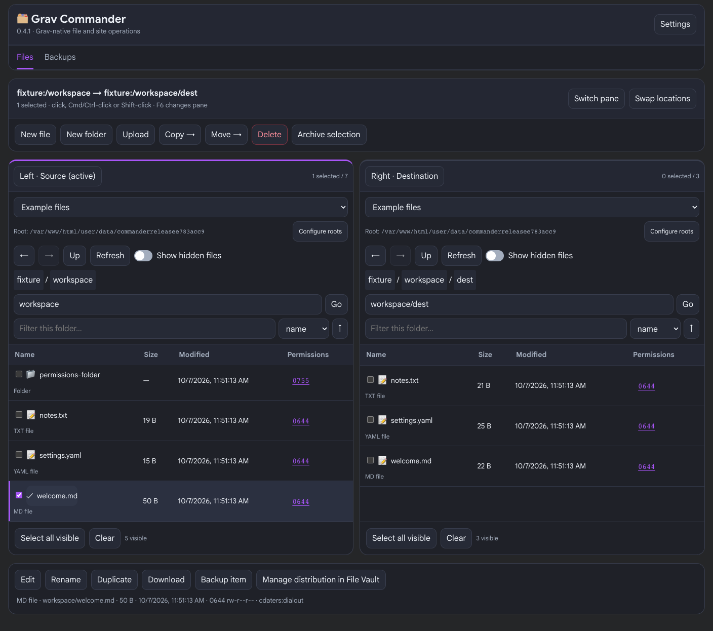
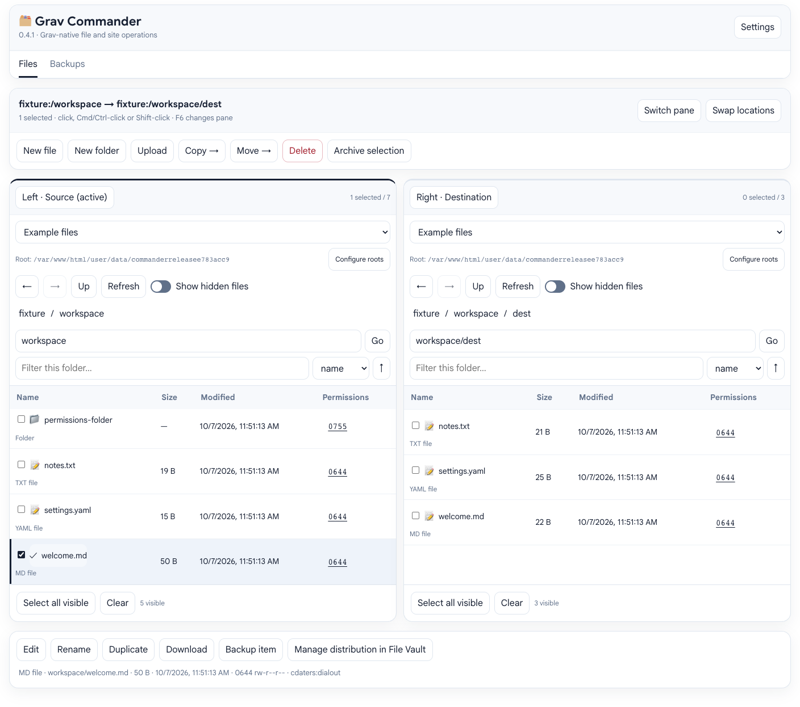
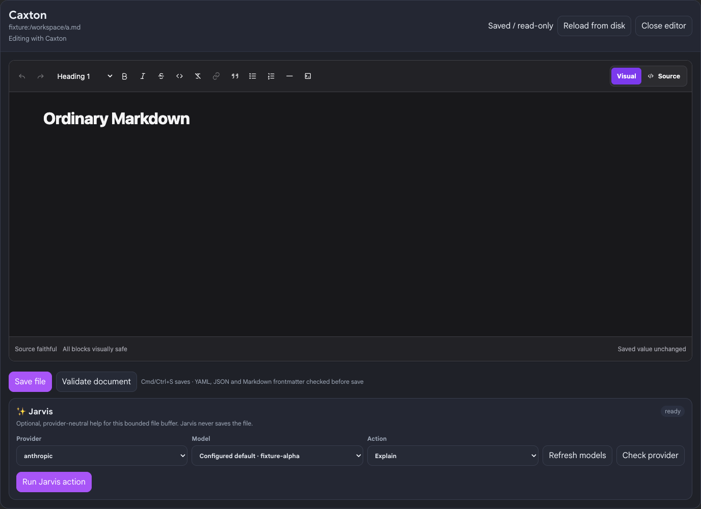
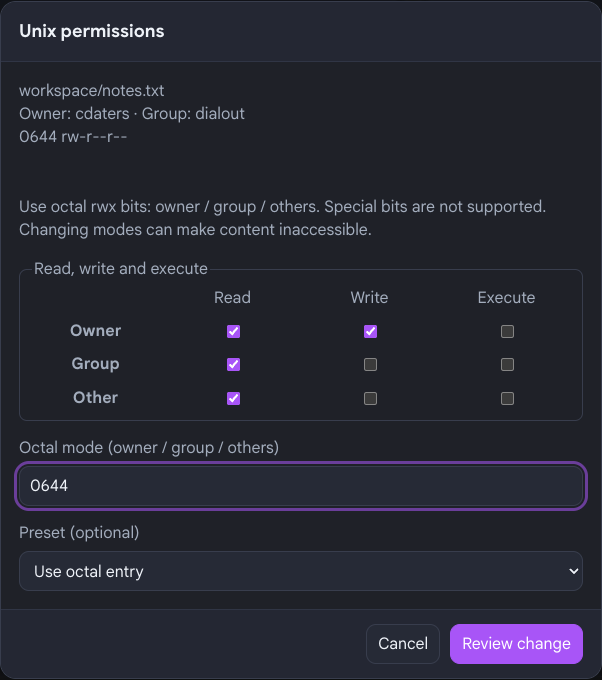
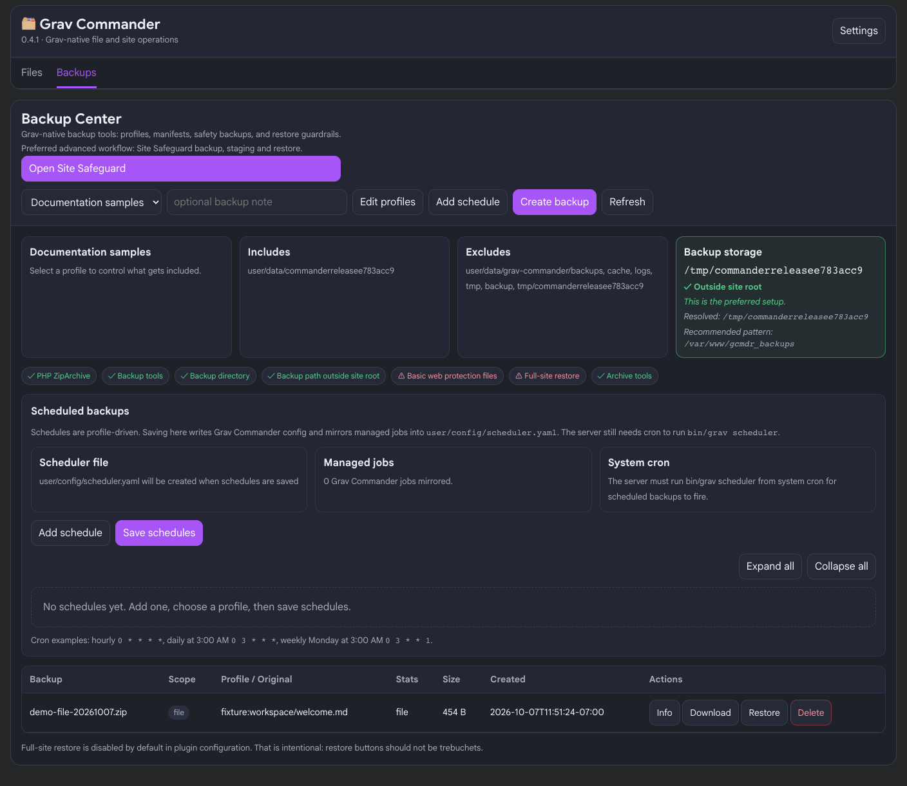

# Grav Commander

Release 0.4.1 of Grav Commander puts a two-pane file manager and Backup Center inside Grav 2's
Admin2. Browse your site's files, copy between folders, edit text, manage ZIPs and
make backups without leaving the administrator interface.

Commander is for trusted administrators. Start on a staging site, give users only
the access they need, and keep an independent backup before changing a live site.



Screenshots show **0.4.1** with sample files on a staging site. Optional controls
appear according to the plugins installed and the user's access.

<details>
<summary>View the Files workspace in light mode</summary>



</details>

## Install or upgrade

You need **Grav 2**, **Admin2 (admin-next)**, **API 1.0.44 or newer**, **PHP 8.3 or
newer**, and PHP's **ZIP extension** for archives, backups and restores.

1. Download the Commander release ZIP from the
   [releases page](https://github.com/cdaters/grav-plugin-grav-commander/releases).
   You can also install with `bin/gpm install grav-commander` or update with
   `bin/gpm update grav-commander` once GPM lists the release.
2. Extract its `grav-commander` folder into `user/plugins/grav-commander` in your
   Grav installation. Avoid a second nested `grav-commander` folder.
3. Enable **Grav Commander** in Admin2's Plugins settings. Clear the Grav cache
   from Admin2, or run `bin/grav clearcache` from the Grav directory.
4. Open **Grav Commander** in the Admin2 sidebar. Its **Settings** button opens
   the plugin's configuration.

To upgrade, back up the site and replace the plugin folder with the new release.
Keep your site configuration in `user/config/plugins/grav-commander.yaml`; changes
made directly to the plugin's own default YAML are replaced by an update. Clear
the cache and reload Admin2 afterward. Review the [changelog](CHANGELOG.md) and
try editing, copying and a backup on staging before using an upgrade on a live site.

## Set up access and locations

Commander separates administrator access into four permissions:

| Permission | Allows |
| --- | --- |
| `grav-commander.browse` | Browse, view and download permitted files. |
| `grav-commander.write` | Create, edit, upload, rename, copy, move, delete, archive and change modes in writable locations. |
| `grav-commander.backup` | Create, manage, download and delete backups; configure profiles and schedules. |
| `grav-commander.restore` | Restore backups, subject to restore settings and confirmations. |

Grant these through your site's user/group access settings. API super authority
also grants access; legacy `admin.super` alone is not enough for API operations.
Read-only roots and the host's own filesystem permissions still apply.

### Configured roots

A **root** is an administrator-approved starting folder. Defaults include Pages,
Themes, Plugins, Config, Data and read-only Logs. Each pane chooses its own root.
The physical server path is shown below the root selector.

**Up stops at the selected root.** To reach the Grav installation or a server-home
folder above it, add that location in **Settings → Additional or overridden
filesystem roots**. **Configure roots** in either pane provides guidance and a
link to these settings. For example:

```yaml
additional_roots:
  - key: site
    label: Grav installation
    path: .
    writable: false
  - key: server-home
    label: Server home
    path: /home/datersne
    writable: false
```

Save settings, return to Commander and choose the new root. `.` means the Grav
installation; `/home/datersne` is an absolute server path, including its leading
slash. If your site's folder is `/home/datersne/public_html`, choosing Server home
lets you enter `public_html` and return to its parent with Up.

Folders must already exist and be accessible to PHP. Use unique keys; a built-in
key replaces that root's definition. Leave broad external roots read-only unless
writes are necessary. They may contain other sites and private account data.
Commander does not grant unrestricted server access: requests stay within the
selected configured root, and symlinks, protected paths and the filesystem root
itself are refused.

### Hidden files

Each pane has a **Show hidden files** switch beside Back, Forward, Up and Refresh.
It starts off and remembers that pane's choice for your user in that browser.
Switching it keeps the folder, history and visible selections. Selected items
that become hidden are deselected to prevent accidental operations on them.

The switch reveals ordinary names starting with a dot. It does **not** unlock
protected files: credential locations such as `.ssh`, `.env` and private keys
remain denied. Copying or archiving a selected folder includes its permitted
hidden contents even when they are not displayed. See
[configuration and safety settings](docs/CONFIGURATION.md) for protected patterns.

## Work with two panes

1. Choose the starting root and folder in each pane.
2. Click a file or a pane heading to make that pane the active **Source**.
   The other pane is the **Destination**.
3. Select items and choose **Copy →** or **Move →**. Review both locations before
   continuing. Copy leaves the originals; Move removes successfully moved originals.

Click selects one item. Checkboxes or Cmd/Ctrl-click select several; Shift-click
selects a range. **Select all visible** follows the pane's filename filter.
Changing the filter clears its selection. Back/Forward, breadcrumbs and the folder
path work independently in each pane; folder paths are relative to the chosen root.
**Swap locations** exchanges the pane locations. On narrow screens, **Switch pane**
or F6 changes the visible pane.

### Files, folders and ZIPs

- **New file**, **New folder** and **Upload** use the active folder. Upload or drop
  one file at a time onto a pane.
- Select one item for **Rename**, **Duplicate**, **Download** or **Backup item**.
  Duplicate creates another copy beside the original using the name you enter.
- **Delete** asks for confirmation. Nonempty folders require recursive deletion
  to be enabled in settings. There is no trash bin or automatic undo.
- **Archive selection** creates a ZIP in the active folder. Download it to collect
  several files together. Select a ZIP to inspect its entries or extract it.
  Extraction refuses overwrites by default and has separate safety settings.
- Supported images have **Preview image**; text files use **Edit** or **View**.

Folders include their contents and page media. Moving a page, plugin or theme does
not repair links, route overrides or dependencies; review those relationships first.
Large operations are limited by Commander and your host. Keep the workspace open
until the result appears. If an operation stops partway through, review the reported
completed, failed and pending items before retrying: earlier changes may remain.

### When a destination already exists

Copy and Move use **Ask** by default. Review each collision and choose:

| Choice | Result |
| --- | --- |
| Skip | Keep both existing locations unchanged for that item. |
| Replace | Replace the destination item, including its contents if it is a folder. |
| Keep both / Rename | Enter another name or leave it blank for a unique name. |
| Merge folders | Keep destination-only items and review conflicts inside the folders. |
| Cancel | Stop the whole transfer before it starts. |

You can apply a decision to remaining compatible collisions. Replace and Merge
appear only when allowed; replacing a nonempty folder requires recursive deletion.
Nothing silently overwrites. Configured safety backups run before replacement.
If the files change during review, Commander requires a new review.

## Edit files

Select a file and click **Edit**, press Enter, or double-click it. Commander chooses
the best available compatible editor automatically; there is no editor picker.
A small **Editing with…** label identifies the editor in use and updates if it
falls back. Native page editing shows **Opening with Grav…** before handing off
to the Grav page editor.

- **Grav page Markdown:** a compatible installed editor, with Caxton preferred by
  the built-in integration; otherwise the native Grav page editor.
- **Other Markdown:** a compatible installed editor, otherwise Commander's Markdown
  toolbar and source area.
- **YAML, JSON, Twig, CSS, JavaScript, HTML and text:** an editor that explicitly
  supports that format safely, otherwise Commander's source editor.

Available providers are checked for enabled status, compatibility and your access,
then ordered by priority. Failed providers fall back safely. Installing an editor
alone does not make it compatible; it must support the public adapter contract.

The Commander editor scrolls into view and receives focus. Its open file stays
attached to its original location while you browse either pane. Markdown fallback
includes headings, emphasis, lists, links, code, tables, undo/redo and a safe preview.
Source editing is plain text; the fallback does not provide syntax highlighting or
line numbers. HTML/Twig are edited as source, not executed in the preview.

**Save file** validates YAML, JSON and Markdown frontmatter before writing.
**Validate document** checks without saving. If the file changed on disk since it
was opened, Save is refused: review your edits, then **Reload from disk** as needed.
Closing or replacing an unsaved editor asks before discarding changes. The native
Grav page editor follows its own normal page editing and validation workflow.

Read-only roots, file size limits, blocked formats and host permissions may limit a
file to viewing or downloading. Server scripts such as PHP and shell scripts are
blocked by default. Do not loosen that policy for untrusted users.



## Linux and Unix file permissions

The **Permissions** column shows values such as **0644** or **0755**. Click the
value itself to open the permissions dialog; selecting the file first is unnecessary.
Hovering highlights its border and underline. Tab gives it a visible focus ring;
Enter opens the same dialog.
It shows the owner and group, readable permission details and applicable warnings.



Permissions describe what the **owner**, members of the **group**, and **other**
users can do. Read means read a file or list a directory. Write means change a file
or change entries in a directory. Execute means run a file; for a directory it means
enter or pass through it. Directory access often needs both read and execute.

Use the read/write/execute boxes, a preset or the octal entry; they stay in sync.
Common presets are `0644` for publicly readable files, `0600` for private files,
`0755` for accessible directories and `0700` for private directories. These are
examples, not a substitute for your hosting provider's ownership and access guidance.

Changes require Commander write access, a writable root, enabled permission changes
and a supported Unix host. Otherwise the dialog is informational. A dash means Unix
mode information is unavailable. Commander does not change ownership or special bits.

**Recursive** applies the same mode to every file and folder below a directory.
It needs an explicit selection and a second confirmation. Removing directory execute
bits can lock out access; adding execute bits to content may be unsafe. There is no
automatic undo. Prefer targeted changes, and review any partial failure report.

## Backups and recovery

Use **Backup item** for a selected file/folder, or the **Backups** tab for a site
backup. Choose a profile, add a useful note and run the backup. Default profiles
cover the full site, user folder, pages/media, and configuration/data. Review the
backup's details, health information and included paths before relying on it.



Safety backups are enabled by default before supported destructive file operations,
including replacement. Keep both `auto_backup_on_write` and `backup.enabled` enabled
to use them. They do not undo chmod or replace an independent recovery backup.

Backups default to `../gcmdr_backups`, beside the Grav directory. Store them outside
the publicly served web directory and restrict access: site backups may contain
accounts and secrets, including data hidden from the Files tab. Retention defaults
to 25 backups; download important recovery copies to separate storage.

Restore requires restore access and confirmation. File backups return to their
recorded configured root and path. Full-site restore is **disabled by default** and
requires `backup.allow_site_restore: true`. Test recovery on staging first and make
a separate current backup before restoring. Restore may overwrite current content;
it is not a deployment or automatic rollback system.

Backup Center can save profiles and schedules. **Saving a schedule does not make it
run:** your host must run Grav's scheduler from cron. See
[advanced configuration, schedules and CLI backup](docs/CONFIGURATION.md).

## Optional integrations

Commander works on its own. Unavailable integrations simply do not appear. If a
companion sounds useful, install and configure it normally; Commander uses its
supported capabilities automatically when your account has the required access.

| Companion | Why you might want it |
| --- | --- |
| **Caxton** | Richer Markdown editing. Commander automatically uses it for supported Markdown, including page content, when Markdown field replacement is enabled. You do not need to select an editor. Caxton's Source mode requires its own permission. |
| **Jarvis** | AI-assisted explanation, summaries, review and proposed text changes. Review a proposal before **Apply**, which changes only the unsaved buffer. **Save file** writes it to disk. Provider accounts, API keys and default models are configured in Jarvis. Review what you send; redaction is not a complete secret scanner. |
| **Site Safeguard** | Advanced backups, staging and recovery. **Open Site Safeguard** in Backups takes you to that workflow with its own access checks and confirmations. Commander's built-in backups remain available. |
| **File Vault** | Controlled file distribution and download management. **Manage distribution in File Vault** opens its management screen; known managed files may show access, password and download details. Commander does not automatically adopt, import or publish files. |
| **Revision Ledger** | Page history. After a changed Grav page is successfully saved in Commander, Ledger can retain the saved version so you can compare or restore it through Ledger's own history screen. See the limits below. |

### What Revision Ledger records

With a compatible, enabled Revision Ledger and **revision-ledger.manage** access,
Commander records the **newly saved content** of recognized Grav page files under
`user/pages`. This includes Commander Markdown/source saves, embedded-editor saves
and Jarvis-assisted changes once you click Save. Ledger identifies the author and
labels the checkpoint **Saved with Grav Commander**. It does not add a separate
AI marker. No Ledger update or required dependency is introduced by Commander 0.4.1.

Opening a file, reviewing or applying a Jarvis proposal, canceling, failed saves
and saves without content changes do not add checkpoints. Ordinary Markdown files,
page attachments, configuration and other non-page files are not tracked.
Bulk copy/replace, uploads, rename/move, delete, archive extraction and backup
restore do **not** add Commander checkpoints. History follows Ledger's existing
page rules; it is not a filesystem activity log or a substitute for backups.

Commander records after Save, so the first checkpoint does not recover the version
that existed before that save. Keep safety backups for that earlier content.
Native Grav page editing retains Ledger's own normal history behavior. Commander
has no separate history browser. If Ledger is missing, disabled or your access
is insufficient, Save still works. If a checkpoint fails after saving, Commander
reports that the file was saved but history was unavailable; do not repeat Save
expecting it to repair history automatically.

## Keyboard and appearance

These shortcuts apply while a file listing has focus; text inputs keep normal editing keys.

| Shortcut | Action |
| --- | --- |
| Up / Down arrows | Move the selection. |
| Enter | Open the selected folder or automatically edit/view the file. |
| Backspace | Go up within the configured root. |
| F2 | Rename the selected item. |
| Delete | Review deletion of the selection. |
| Cmd/Ctrl+A | Select visible items. |
| Cmd/Ctrl+C / X | Remember selected items for copy / move. |
| Cmd/Ctrl+V | Copy / move into the focused pane's folder, with review. |
| F6 | Switch panes. |
| Cmd/Ctrl+S | Save the open editable buffer. |
| Escape | Cancel a dialog; clear listing selection or close the editor with an unsaved-change check, depending on focus. |

Tab reaches controls, including mode values and hidden-file switches. Enter opens a
focused permission value; Space toggles a focused switch. Dialogs keep keyboard
focus inside and return it when closed. Commander follows Admin2's **Light**, **Dark**
or **Follow OS** appearance. Leaving a browser tab with unsaved work may also show
the browser's own required leave-page warning.

## Troubleshooting

- **Commander is missing:** check that the plugin and sidebar setting are enabled,
  Admin2/API meet the requirements, and your user has browse access. Clear the cache.
- **Cannot go above Pages/public_html:** add an approved broader root in settings,
  then select it. Typing `..` or an absolute path into Folder path does not bypass roots.
- **Root unavailable or access denied:** check the server path, its leading slash,
  PHP access, read-only setting and protected patterns. Symlink roots are not supported.
- **Dotfile still absent:** turn on that pane's switch. Protected items remain hidden;
  a filename filter may also exclude the item. Browser storage restrictions can prevent
  remembering the switch.
- **Cannot edit or save:** check write access, format/size limits and host permissions.
  Fix validation errors. For a stale-save warning, preserve your draft and compare it
  with the disk version before reloading.
- **Optional editor or Jarvis missing:** check that plugin's enablement, permissions
  and compatibility. Jarvis's **Refresh models** retries discovery; a failed catalog
  request can still leave its configured default selected.
- **Backup/extraction fails:** check PHP ZIP support, free space, storage permissions
  and host execution limits. Split large operations and review partial results.
- **Schedule never runs:** confirm host cron invokes Grav's scheduler and inspect its logs.
- **Mode change refused:** PHP may not own the file or the host may prohibit chmod.
  Ask the host about ownership; do not fix this by making everything world-writable.

For settings and limits, see [Configuration](docs/CONFIGURATION.md). For plugin
authors, see [Editor adapters](docs/EDITOR-ADAPTERS.md) and [Revision Ledger integration](docs/REVISION-LEDGER.md). Report reproducible issues
with versions and redacted error details on the
[issue tracker](https://github.com/cdaters/grav-plugin-grav-commander/issues).
Never include credentials or private file contents.
