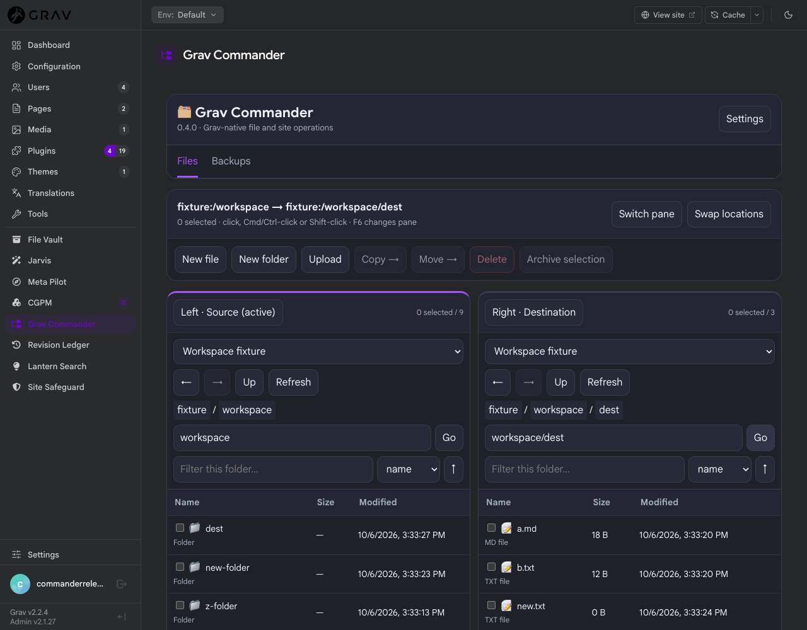
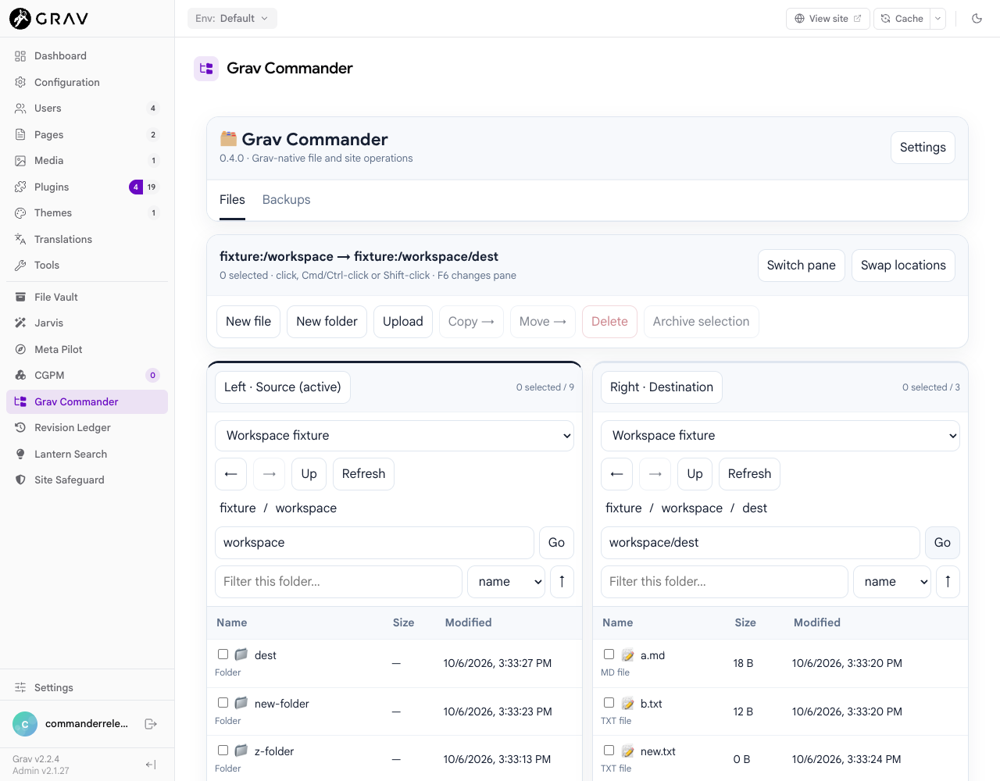

# Grav Commander

Release 0.4.0 is a Grav-native file and site operations workspace for Admin2.

## Workspace quickstart

Each pane has its own root, folder, breadcrumbs, back/forward history, filename
filter and sort order. Click an item or the pane heading to choose the active
**Source**; the other pane is the **Destination**. Copy and Move show both locations
and the selected paths before submitting one coordinated request. At widths under
850px, use **Switch pane** (or F6) to work with one location at a time.

Click selects, checkboxes or Cmd/Ctrl-click toggle, Shift-click selects a range, and **Select all
visible** selects the current filtered list. Changing the filter clears selection,
so hidden files cannot accidentally be included. Folders include their contents and
associated page media. Duplicate asks for a new name beside the original; numbered
page folders retain their full contents. Rename does not renumber other pages.

New file creates an empty allowed text file (JSON starts as `{}`). New folder works
at the root too. Upload accepts one file at a time, including desktop drops onto a
pane. Archive selection creates one ZIP in the active folder; download that ZIP for
a multi-item download. ZIP inspection lists bounded entries before extraction.
Image previews support PNG/JPEG/GIF/WebP/AVIF up to 10 MB. Active content is never
rendered as HTML; text and archive names are escaped.

The editor stays open while either pane navigates. It records the file's own root,
path and SHA-256 revision. Save validates YAML, JSON and Markdown frontmatter;
external disk changes require reload/review. Close, replacement, native editor
launch, sidebar navigation and browser unload guard unsaved edits. Reload requires
confirmation if dirty. Jarvis Apply still updates only the unsaved buffer.

Keyboard shortcuts apply inside a file listing: arrows navigate/select, Enter opens,
Backspace goes up, F2 renames, Delete confirms deletion, Cmd/Ctrl+A selects visible
items, Cmd/Ctrl+C/X records copy/move intent, and Cmd/Ctrl+V operates in the focused
pane. F6 switches panes; Cmd/Ctrl+S saves an editable buffer; Escape cancels dialogs
or closes the editor with dirty protection. Text inputs keep ordinary editing keys.

Copy/move defaults to **Ask** when a destination exists. Choose **Skip**, **Replace**,
**Keep both / Rename**, or **Cancel**, with an option to apply the choice to remaining
compatible collisions. Cancel stops the entire transfer before mutation. Keep both
accepts a new name or generates a unique one. **Merge folders** retains destination-only
items and reviews child collisions; **Replace** replaces the whole destination and
requires recursive deletion to be enabled for nonempty folders. Skipped move items
remain at the source. Replacement first stages the source and makes a safety backup
when `auto_backup_on_write` and `backup.enabled` are enabled. Backup filenames cannot
reuse an existing archive, including multiple backups in the same second.

The entire selection is checked before mutation, including duplicate/overlapping paths
and recursive-delete policy. Decisions are bound to source/destination revisions;
changes while reviewing a collision require a fresh review. Nothing silently overwrites. Defaults
limit a request to 200 selected paths, 10,000 descendants and 512 MiB; advanced
configuration keys are `max_operation_files` and `max_operation_bytes`. Split larger
work into smaller operations. Paths stay inside configured roots; symlinks, special
files, root mutations and self-descendant destinations are rejected. Permissions,
API scope/demo restrictions, blocked formats, pre-destructive backups and guarded
restore remain enforced on the server.

Batches are coordinated, **not filesystem transactions**. A later I/O failure can
leave earlier items completed; Commander reports completed, failed and unattempted
items. A partial copy may remain at its destination. Reload both locations and review
before retrying. Keep the workspace open during operations: status is indeterminate,
not a fabricated percentage, and server work cannot be cancelled from the browser.
No persistent/background job queue is claimed.

Grav-aware labels identify page folders/media, plugin/theme package contents and
configuration. Markdown beneath the actual `user/pages` tree offers **Open in Grav
Editor** as the primary action (also Enter/double-click), as well as **Edit Raw**, even
through a custom root alias. Edit Raw opens, scrolls to and focuses the pinned editor
without resetting either pane. Ordinary Markdown has a primary **Edit Markdown**
action with Heading, Bold, Italic, Strikethrough, lists, Quote, Code, Link, Image and
Divider tools. These modify only the selected unsaved source; Save remains explicit.
Cmd/Ctrl+B and I format the selection, and native textarea undo is retained where
supported. **Edit Raw** and **Show Markdown tools** switch views without losing edits.
This small source toolbar uses standard browser editing APIs; Commander does not
import Admin2's private page-editor components or add an editor-plugin abstraction. YAML/JSON/Twig/CSS/JS and other
allowed text use the raw code/text editor. Validation and stale-save checks remain.
App-owned prompts and confirmations use themed, keyboard-accessible Commander dialogs
with focus trapping, Escape and return focus. Browser tab/window unload protection
still uses the browser's required native before-unload mechanism. Commander does
not rewrite page links, route overrides, plugin registrations or theme dependencies
when files move. Review those site relationships before moving package/page folders.

Syntax highlighting, line-number gutters, cross-pane drag/drop, recursive search,
semantic refactoring, and resumable background jobs remain future work. The workspace
inherits Admin2 Light, Dark and Follow OS preferences.


Grav Commander is an Admin2-first file manager, archive toolkit, and guarded Backup Center for Grav 2.

It is intentionally cautious. Grav Commander is meant to help trusted administrators handle common file, ZIP, and backup work from inside Admin2 without turning Grav into an unchecked hosting control panel.

## Status / Alpha Notice

Grav Commander is alpha software for Grav 2 and Admin2. Use it locally or on staging first, review the configured roots and permissions, and keep independent server backups for production sites.

## Screenshots

### Dark Mode

| Plugin Settings | Plugin Settings, continued |
|:---:|:---:|
|  |  |

| Files | Backup Center |
|:---:|:---:|
|  |  |

| Backup Center, continued |
|:---:|
|  |

### Light Mode

| Plugin Settings | Plugin Settings, continued |
|:---:|:---:|
|  |  |

| Files | Backup Center |
|:---:|:---:|
|  |  |

| Backup Center, continued |
|:---:|
|  |

## Features

- Admin2 sidebar page with Files and Backups sections.
- Configured root browser for pages, themes, plugins, config, data, and logs.
- Text file viewing and editing with extension allow/block lists.
- Upload, download, rename, copy, move, delete, and folder creation actions.
- ZIP creation and guarded ZIP extraction.
- Backup profiles with friendly and expert editing modes.
- Manual site, file, and folder backups.
- Safety backups before destructive file operations when enabled.
- Backup notes, manifests, health checks, details modal, download, delete, and guarded restore.
- Scheduled backup definitions mirrored into Grav scheduler custom jobs.
- CLI backup command for cron, SSH, or scheduled workflows.
- Optional Jarvis assistance for bounded eligible text files, with provider/
  model discovery, explicit preview, and unsaved-buffer-only Apply.

## Requirements

- Grav 2.0 or newer.
- Grav API plugin 1.0.44 or newer.
- Admin2 / admin-next.
- PHP 8.3 or newer.
- PHP `zip` extension for archive, backup, and restore tools.
- Server cron running `bin/grav scheduler` if scheduled backups should run automatically.

## Installation

Install the plugin into:

```text
user/plugins/grav-commander
```

The plugin folder should contain at least:

```text
grav-commander.php
blueprints.yaml
grav-commander.yaml
permissions.yaml
admin-next/pages/grav-commander.js
cli/BackupCommand.php
classes/
```

Enable the plugin through Admin2 or in `user/config/plugins/grav-commander.yaml`:

```yaml
enabled: true
```

Clear the Grav cache after installing or updating:

```bash
bin/grav clearcache
```

Open Admin2 and look for **Grav Commander** in the sidebar.

## Configuration

Default configuration lives in `grav-commander.yaml`. Site-specific overrides belong in:

```text
user/config/plugins/grav-commander.yaml
```

Important settings include:

```yaml
admin:
  show_sidebar: true

max_upload_size: 10485760
max_edit_size: 1048576
allow_php_editing: false
allow_recursive_delete: false
auto_backup_on_write: true

jarvis:
  enabled: true
  max_context_bytes: 49152
  max_large_context_bytes: 196608

backup:
  enabled: true
  path: ../gcmdr_backups
  max_backups: 25
  allow_site_restore: false
```

The default backup path is `../gcmdr_backups`, resolved relative to the Grav root. On many hosts this places backups beside the public site directory rather than inside it. For production, prefer an absolute or relative path outside the public web tree when your host allows it.

Grav Commander creates the backup folder when needed and writes basic `.htaccess` and `index.html` protection files, but outside-root storage is still preferred.

## Permissions

The plugin declares these permissions in `permissions.yaml`:

```yaml
grav-commander:
  browse: true
  write: true
  backup: true
  restore: true
```

Super admin users should have access automatically. For non-super users, grant only the capabilities they need:

- `browse`: list, view, and download allowed files.
- `write`: create, edit, upload, rename, copy, move, delete, zip, and extract inside writable roots.
- `backup`: create, list, download, configure, run, and delete backups.
- `restore`: restore file/folder backups and, only if enabled, full-site backups.

## File Manager Behavior

Configured roots are defined under `roots` in site plugin configuration. The Admin2
plugin settings also expose **Additional or overridden filesystem roots** (`additional_roots`):

```yaml
additional_roots:
  - key: server-home
    label: Server home
    path: /home/datersne
    writable: false
```

The Files pane displays the configured root's physical path. **Up** stops at that
boundary; a relative Folder path cannot navigate above it. Choose **Configure roots**
for setup guidance and a link to the native plugin settings. Add a `site` entry with
path `.` to expose the Grav installation (often `public_html`). Add an explicit absolute
server-home path to expose its parent. Save settings and return to Commander, then
select the new root independently in either pane. Do not omit the leading `/` on
absolute hosting paths.

An additional entry with a built-in key overrides that root. Additional keys must be
unique. Paths may be site-relative or absolute; directories must already exist and
be accessible to PHP. Enable writes only for roots administrators intend to modify.
Each pane chooses independently from this configured allowlist. Invalid roots are
unavailable. Root paths are canonicalized; a full filesystem root, symlink root,
unknown root, absolute request path, traversal, symlink descendant or special file
is rejected. A server-home root does not permit navigating to its parent.

When Site Safeguard is installed, enabled and its public status endpoint authorizes
the current user, Backup Center presents **Open Site Safeguard** as the preferred
advanced backup/stage/restore workflow. This opens its native Admin2 page; Safeguard
retains its own permissions, staging and confirmation gates. Commander imports no
Safeguard internals and its existing backups remain functional without Safeguard.

Files are handled in three broad modes:

- Editable: allowed by `editable_extensions`, not blocked, inside a writable root, writable on disk, and below `max_edit_size`.
- View/read-only: allowed by `viewable_extensions`, not blocked, and text-like.
- Binary/read-only: selectable and downloadable, but not opened in the editor.

Executable and server-side script extensions are blocked by default:

```yaml
blocked_extensions:
  - php
  - phtml
  - phar
  - sh
  - bash
  - zsh
  - exe
```

Do not remove risky extensions from `blocked_extensions` on production sites unless every Admin user with access is fully trusted.

Markdown files under the Pages root can be opened in Grav's page editor. Raw text editing remains available for power users.

## Optional Jarvis actions

When `grav-jarvis` is installed and enabled, Commander can consume its
public PHP service for one bounded file at a time. Jarvis is optional: removing,
disabling, or misconfiguring it hides or fails only the Jarvis panel. Browsing,
editing, archives, backups, and every other Commander feature continue to work.

Eligible text/source files receive these actions:

- Explain, Summarize, and Review return read-only results.
- Improve / Rewrite and Custom Prompt may return a complete proposal when the
  file is editable and the source was neither truncated nor redacted.
- Markdown Summarize may use Jarvis's public bounded chunk/synthesis contract.
  Explain and Review visibly truncate above the direct-context limit. Improve
  and Custom Prompt reject partial-file rewriting.

Commander reads the preferred provider and its named default model from Jarvis's
public `/grav-jarvis/bootstrap` API when the current user can access it. Model discovery
starts automatically when an eligible editor opens and when the provider changes;
**Refresh models** retries discovery. Catalog failures retain the configured default,
and late responses from a previous provider cannot replace the current selection.
This metadata loading does not generate content or save files. If bootstrap metadata
is unavailable, Commander keeps its existing public-service fallback.

The panel lets the user select a registered text provider, use its configured
default model or discover a neutral model catalog, validate configuration
without generation, run an action, inspect context limits and normalized
usage/cost/retry/cache information, then Copy, Reject, or explicitly Apply.
Browser requests cannot select a provider class, endpoint, header, credential,
or environment-variable name.

Apply means **apply to the current unsaved Commander editor buffer**. It does
not call the write endpoint. A hash-only 15-minute receipt binds the actor,
configured root, relative path, disk modified/size version, source buffer, and
proposal. Cross-user, cross-file, changed-source, changed-disk, expired,
rejected, and replayed application fails closed. The normal **Save file**
button remains the only way to persist that buffer and retains Commander's
existing write permission and safety-backup behavior.

Both permission families are mandatory on the backend:

- Explain, Summarize, Review, provider validation, and model discovery require
  `grav-commander.browse` plus `grav-jarvis.use`.
- Improve / Rewrite, Custom Prompt, and Apply additionally require
  `grav-commander.write`.

Commander reuses only `Grav\Plugin\GravJarvis\Contracts` and
`$grav['gravJarvis']`. It does not read Jarvis configuration, credentials,
providers, transport, cache, retry, budget, chunking implementation, Admin
services, or test fixtures.

The disclosure policy is deliberately conservative. `.env` files, account/
credential/secret/private-key locations, private-key bodies, unsupported or
binary files are refused. High-confidence credential assignments and bearer/
token values in otherwise eligible text are replaced with `[REDACTED]`, and a
redacted result can never be applied. This bounded policy is a guardrail, not a
general secret scanner; operators should still review the visible context and
avoid sending sensitive files to any provider.

## Archive Tools

Archive tools currently focus on ZIP files:

- Create a ZIP from a selected file or folder.
- Upload a `.zip` file and extract it under the selected root.
- Extract to the ZIP's current folder or another path under the same root.
- Keep no-overwrite extraction by default.
- Optionally allow overwrite through plugin configuration.
- Guard against absolute paths and parent-directory traversal in ZIP entries.
- Optionally skip common macOS ZIP clutter such as `__MACOSX`, `.DS_Store`, and `._filename`.

Relevant defaults:

```yaml
archive:
  enabled: true
  allow_create: true
  allow_extract: true
  allow_overwrite: false
  backup_before_extract: true
  max_extract_files: 5000
  max_extract_bytes: 209715200
  skip_macos_junk: true
```

## Backup Center

The Backup Center provides profile-driven site backups and safety backups for file operations.

Default profiles:

- `full_site`: the Grav root, excluding cache/log/temp/backup folders.
- `user_folder`: the `user/` folder.
- `pages_media`: `user/pages` only.
- `config_data`: `user/config`, `user/accounts`, and `user/data`.

Backups include `backup-info.json`, and site backups also include a manifest. Backup notes and metadata can be reviewed from the backup row info button.

Backup file names use a configurable token template:

```yaml
backup:
  archive_name_template: gcmdr-[HOST]-[PROFILE]-[DATE]-[TIME_TZ]
  add_random_if_inside_site_root: true
```

The `.zip` extension is added automatically. If backups are configured inside the site root and `[RANDOM]` is not in the template, Grav Commander can add a random suffix as a guardrail.

Full-site restore is disabled by default:

```yaml
backup:
  allow_site_restore: false
```

Leave full-site restore disabled unless you are intentionally testing or recovering a site.

## Scheduled Backups

Schedules are edited in the Backup Center and saved to the plugin configuration. When schedules are saved, Grav Commander mirrors managed jobs into:

```text
user/config/scheduler.yaml
```

Managed job IDs use the `grav-commander-backup-` prefix.

Example cron expressions:

```text
0 * * * *      hourly at minute 0
0 3 * * *      daily at 3:00 AM
0 3 * * 1      weekly Monday at 3:00 AM
0 3 1 * *      monthly on the 1st at 3:00 AM
```

The server must still run Grav's scheduler from system cron, for example:

```bash
* * * * * cd /path/to/grav && bin/grav scheduler 1>> /dev/null 2>&1
```

Without that host-level cron entry, schedules can be saved but will not run automatically.

## CLI Usage

Create a backup with a configured profile:

```bash
bin/plugin grav-commander backup --profile=pages_media --reason=manual-cli --note="Before content edits"
```

Options:

```text
--profile, -p   Backup profile key. Default: full_site
--reason, -r    Reason stored in metadata. Default: cli
--note          Optional note stored in metadata.
```

Scheduled backup jobs use the same command internally.

## Security Notes

- Treat file management, archive extraction, backup download, and restore as trusted-admin features.
- Keep `blocked_extensions` conservative.
- Keep backups outside the public site root when possible.
- Use dedicated permissions for non-super users.
- Keep full-site restore disabled unless actively needed.
- Test restores on staging before relying on production recovery.
- Backup download links use short-lived, one-time tokens requested by an authenticated Admin2 session, then stream through a token-only browser download route.
- Jarvis is optional and receives only the current bounded eligible buffer
  after backend containment, sensitivity, permission, provider-validation, and
  capability checks. Provider credentials remain environment-only in Jarvis.
- Jarvis output is untrusted text. Review it before Apply and again before Save.
- Basic `.htaccess` protection helps Apache, but Nginx, Caddy, and other servers need server-level rules if backups are exposed under the web root.

## Known Limitations

- Grav 2 and Admin2 are still moving targets.
- The editor is intentionally simple and is not yet a full code editor.
- ZIP support is currently limited to ZIP archives.
- Long-running large backups depend on PHP and hosting limits.
- Scheduler jobs require host cron; saving a schedule alone is not enough.
- Full-site restore is intentionally guarded and should be considered a recovery tool, not a deployment system.
  Large backup downloads stream through a tokenized browser route so the browser can handle the ZIP directly without loading the full archive into Admin2 JavaScript memory.
- Jarvis does not analyze directories, binary/media contents, multiple files,
  selections, or site-wide context. It has no autonomous file write, job, MCP,
  or background workflow in Commander.
- Proposal Apply and ordinary editor Save both detect changed disk content; Apply
  remains separate from the explicit Save action.

## Roadmap Link

See [ROADMAP.md](ROADMAP.md) for directional plans.

## Contributing / Feedback

Issues, testing notes, and focused pull requests are welcome at:

```text
https://github.com/cdaters/grav-plugin-grav-commander/issues
```

Grav Commander is maintained by Craig Daters. PixelWizard may appear in community context, but project metadata uses the professional author name.

## License

MIT. See [LICENSE](LICENSE).

## Current API authorization

API/Admin2 operations require API plugin **1.0.44 or newer**. The API permission resolver enforces API-key scopes, group grants and demo restrictions. Grant the documented plugin permissions plus `api.access`, or use `api.super` for a trusted API administrator. Legacy `admin.super` alone is not API authority. Keep API keys narrowly scoped; no permission bypass is provided by this plugin.

## Distribution

0.4.0 is a separate immutable release candidate. Existing public release bytes
remain unchanged. Authoritative development uses the deterministic public export;
release publication and repository catalog promotion are separate operator actions.
